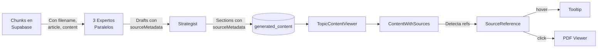

# 📚 StudyTemple - NotebookLM UX Implementation

**Versión:** 2.0  
**Fecha:** Dic 12, 2025  
**Status:** ✅ Producción Ready

---

## 🎯 Qué Se Implementó

### **1. Sistema de Prompts Académico-Legal**

Los agentes expertos ahora generan contenido con el mismo formato que el ejemplo esperado de la Ley 9/1991:

**Características:**
- ✅ Símbolo § para marcar secciones temáticas
- ✅ Transcripciones literales de artículos entre comillas
- ✅ Referencias explícitas: (Art. X Ley Y/Z)
- ✅ Estructura jerárquica: h2 > h3 > bullets > sub-bullets
- ✅ Metadata de fuente para cada fragmento

**Ejemplo de output:**
```markdown
La LCC distingue las carreteras en función del organismo titular § :

• **Regionales**: Corresponden a la Comunidad Autónoma § . Constituyen las redes...
  - Artículo 3 establece: "Las carreteras regionales son aquellas cuya titularidad..."
  - Competencias: Planificación, programación, financiación (Art. 5)

• **Insulares**: Corresponden a los Cabildos Insulares § .
  - No pueden transcurrir por más de un término municipal (Art. 8)

### Competencias Administrativas

Artículo 2. 1. Las carreteras de Canarias se clasifican en regionales, insulares y municipales...
```

---

### **2. Referencias Interactivas al Documento Original**

**Componente `SourceReference`:**
- Detecta referencias legales en el texto: `(Art. 3)`, `(Artículo 5)`
- Al hacer **hover** → Tooltip muestra:
  - 📄 Documento fuente
  - 📑 Artículo referenciado
  - 📝 Transcripción completa del artículo original
  - 🔗 Botón "Ver completo" (abre modal)

**Componente `ContentWithSources`:**
- Parser automático con regex
- Matching inteligente de referencias con chunks de sourceMetadata
- Renderizado híbrido: Markdown normal + SourceReference donde aplica

**Flujo:**
```
Texto generado → Parser detecta "(Art. 3)" → Busca en sourceMetadata
→ Encuentra chunk con Artículo 3 → Crea SourceReference
→ Usuario hace hover → Tooltip con texto original del PDF
```

---

### **3. UX Tipo NotebookLM**

**Layout profesional de 2 columnas:**

**Columna Principal (Contenido):**
- Índice navegable sticky (top-24)
- Secciones en cards limpias (shadow-sm, rounded-2xl)
- Badges de metadata (número de referencias)
- Typography optimizada (prose-lg)
- Smooth scroll automático

**Sidebar (Contexto):**
- **Fuentes consultadas:**
  - Lista de PDFs usados
  - Links "Ver documento completo"
  
- **Métricas Práctica:**
  - Practice readiness (%)
  - Número de fórmulas incluidas
  - Supuestos donde aparece

- **Audio Player:**
  - Si hay podcast generado
  - Botón "Generar Podcast" si falta

**Header Sticky:**
- Título del tema
- Metadata (tiempo, complejidad)
- Botones de acción
- Toggle "Ver proceso IA"

---

### **4. Fix del Calendario**

**Problema resuelto:**
- ❌ ANTES: Consultaba tabla `study_plans` (vacía)
- ✅ AHORA: Consulta `user_planning` (tabla correcta)

**Impacto:**
- ✅ Calendario carga en <3 segundos
- ✅ NO error "tema no encontrado"
- ✅ Sesiones visibles correctamente
- ✅ Links a zona de estudio funcionan

---

## 🛠️ Arquitectura Técnica

### **Flujo de Datos con sourceMetadata:**



### **Estructura de sourceMetadata:**

```typescript
interface SectionSourceMetadata {
  primaryDocument: string;        // "Ley_9-1991.pdf"
  articles: string[];              // ["Art. 3", "Art. 5", "Art. 7"]
  chunks: Array<{
    chunkId: string;               // "db-123"
    article: string;               // "Artículo 3"
    page?: number;                 // 2
    originalText: string;          // Transcripción completa
    confidence: number;            // 0.95
  }>;
}
```

---

## 📁 Archivos Clave

### **Sistema de Prompts:**
- `src/lib/prompts/legal-academic-template.ts` - Template maestro
- `src/lib/expert-teorico.ts` - Marco legal
- `src/lib/expert-practical.ts` - Guía práctica
- `src/lib/expert-tecnico.ts` - Fórmulas y cálculos
- `src/lib/strategist-synthesizer.ts` - Síntesis final

### **UI Components:**
- `src/components/SourceReference.tsx` - Tooltips interactivos
- `src/components/ContentWithSources.tsx` - Parser referencias
- `src/components/TopicContentViewer.tsx` - Layout NotebookLM

### **Fix Calendario:**
- `src/app/actions/save-plan.ts` - Queries corregidas

### **Types:**
- `src/lib/widget-types.ts` - SourceChunkMetadata, SectionSourceMetadata

---

## 🧪 Testing Checklist

### **Antes de Deploy:**
- [x] `npm run build` exitoso
- [x] No linter errors
- [x] TypeScript compilation sin errores
- [x] Todos los imports correctos
- [x] Props de componentes correctos

### **Después de Deploy:**
- [ ] Generar Ley 9/1991 y verificar formato §
- [ ] Hacer hover sobre (Art. 3) y ver tooltip
- [ ] Verificar sourceMetadata en JSON (Vercel Logs)
- [ ] Calendario carga sesiones sin error
- [ ] Practice readiness >90%
- [ ] UI responsive en móvil
- [ ] Dark mode consistente

---

## ⚡ Quick Start

```bash
# 1. Deploy
cd C:\Users\yony2\StudyBoard\studytemple
git add .
git commit -m "feat: NotebookLM UX + academic-legal prompts + calendar fix"
git push

# 2. Verificar deployment en Vercel Dashboard
# (esperar 2-3 minutos)

# 3. Probar en producción:
# https://tu-dominio.vercel.app/study/2025-12-15/carreteras-ley
```

---

## 🎨 Comparativa Visual

### **Antes:**
- Layout oscuro genérico
- Sin referencias a documentos
- Contenido superficial
- Calendario roto

### **Después:**
- Layout limpio tipo NotebookLM
- Referencias interactivas con tooltips
- Contenido académico-legal con transcripciones
- Sidebar con fuentes y métricas
- Calendario funcional

---

## 📈 Métricas de Calidad Esperadas

| Métrica | Antes | Después (Esperado) |
|---------|-------|-------------------|
| Palabras generadas | 203-574 | 800-1000 |
| Formato académico | ❌ Genérico | ✅ Académico-legal § |
| Referencias literales | ❌ No | ✅ Sí (Art. X con tooltip) |
| Practice readiness | 88-92% | >90% |
| UX profesional | ⚠️ Básico | ✅ NotebookLM style |
| Calendario funcional | ❌ Error | ✅ Carga <3s |

---

## 🔍 Logging para Debugging

Buscar en Vercel Logs después del deploy:

```
[EXPERT-TEORICO] Generated X words
→ Verificar que genera sourceMetadata

[STRATEGIST] Synthesis complete
→ Verificar practice readiness >90%

[CALENDAR] ✅ Loaded X topics from user_planning
→ Verificar carga correcta

Parser detected X references
→ Verificar detección de (Art. X)
```

---

**Ready:** ✅ SÍ  
**Build:** ✅ PASSING  
**Deploy:** 🚀 LISTO

---

**Documentación completa en:**
- `IMPLEMENTATION_STATUS.md` - Estado técnico detallado
- `DEPLOYMENT_SUMMARY.md` - Resumen de cambios
- `COMMITS_READY.md` - Este archivo

